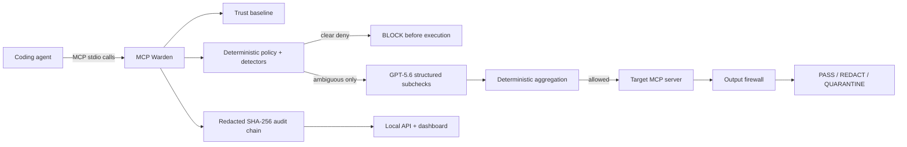

# MCP Warden

> A local-first security gateway that inspects MCP tools, calls, and outputs before coding agents can execute unsafe actions.

MCP Warden is an MCP server to the coding agent and an MCP client to one local stdio target. It verifies tool metadata, applies deterministic policy before execution, sends only genuinely ambiguous calls to three structured GPT-5.6 checks, inspects returned content, and writes a redacted tamper-evident audit trail. Clear violations are blocked before the target tool body runs.

Current release: `v0.1.0-rc.1` · Category: Developer Tools · License: Apache-2.0

## Run the keyless demo

Requirements: Node.js 20+ (22 tested), npm, and Git. No OpenAI key is needed.

```powershell
# From an extracted or cloned MCP Warden source checkout:
cd McpWarden
npm.cmd ci
npm.cmd run build
npm.cmd run demo:offline
node .\apps\cli\dist\index.js dashboard --config .\warden.config.example.yaml
```

Open `http://127.0.0.1:4782`. The dashboard is explicitly labeled `OFFLINE FIXTURE REPLAY`. Try Path Traversal in Attack Lab: expected and actual are `BLOCK`, and the vulnerable target's execution counter proves the blocked call never reached the tool body.

On macOS/Linux, use `npm` and `/` path separators. See [supported platforms](docs/supported-platforms.md) for exact status.

## Prebuilt judge experience

After the public image is published, no source build or API key is required:

```bash
docker compose -f docker-compose.judge.yml pull
docker compose -f docker-compose.judge.yml up
```

Open `http://127.0.0.1:4782`. The container binds only to localhost, runs as non-root with a read-only filesystem and `no-new-privileges`, and serves the recorded snapshot. Until publication, use the local-image override in the [judge guide](docs/judge-guide.md).

## How it works



The API and dashboard observe recorded state; they are never in the enforcement path. See the [architecture](docs/architecture.md) and [threat model](SECURITY_ASSUMPTIONS.md).

## Security decisions

Request decisions are `ALLOW`, `ASK_USER`, or `BLOCK`. Output decisions are `PASS`, `REDACT`, or `QUARANTINE`.

- Persistent trust detects added, removed, schema-changed, description-changed, and poisoned tools.
- Deterministic detectors cover traversal/symlink escape, secret paths, shell metacharacters, destructive commands, SSRF/private endpoints, suspicious protocols, and policy tampering.
- Hard denies cannot be overridden by GPT-5.6.
- Output inspection redacts credential-like values and quarantines returned prompt injection or suspicious URLs.
- Enforce mode fails closed if required policy, trust, audit, or semantic judgment is unavailable.
- Remediation is a read-only, schema-validated Codex proposal; Warden never auto-applies it.

## Exactly where GPT-5.6 is used

GPT-5.6 is not a general controller. After deterministic checks, an ambiguous call triggers three independent Responses API structured-output requests:

1. scope safety;
2. exfiltration risk;
3. tool integrity.

TypeScript validates each result with Zod and aggregates it deterministically. Model output cannot weaken policy or override a hard deny. Timeouts, malformed output, unavailable credentials, and call-limit exhaustion are safe failures. The recorded replay is clearly labeled and performs no network call. Live mode is optional:

```powershell
node --env-file=.env.local .\scripts\judge-smoke.mjs
```

Live acceptance is currently deferred because the selected OpenAI project returned account-inactive HTTP 429; no credential is stored in this repository. Details: [evaluation](docs/evaluation.md).

## Exactly how Codex was used

Codex accelerated the workspace architecture, proxy, detectors, attack corpus, tests, dashboard, container, and release workflows in the primary project task. At runtime, Warden can invoke real `codex exec` in a read-only sandbox with redacted evidence and a strict output schema. A proposal is temporarily verified against schema, security invariants, and regression tests, then requires explicit human review and `--yes` before application.

The full record is in [Codex collaboration](docs/codex-collaboration.md), [human decisions](docs/human-decisions.md), and [engineering decisions](DECISIONS.md).

## CLI

```text
warden doctor --config <file>
warden policy validate --config <file>
warden trust create|inspect|diff|approve --config <file>
warden run --config <file>
warden dashboard --config <file>
warden audit verify <session-id> --config <file>
warden report <session-id> --format json|markdown --config <file>
warden remediation inspect|reject|apply <proposal-id> --config <file>
```

The proxy speaks MCP JSON-RPC on stdout. Human diagnostics and lifecycle events use stderr only.

## Audit verification

Audit JSONL is recursively redacted before persistence. Each canonical event includes its sequence, previous hash, and SHA-256 event hash.

```powershell
node .\apps\cli\dist\index.js audit verify <session-id> --config .\warden.config.example.yaml
node .\apps\cli\dist\index.js report <session-id> --format markdown --config .\warden.config.example.yaml
```

The snapshot's downloadable `audit.jsonl`, JSON/Markdown reports, and evaluation summary are also available from the dashboard. The chain is tamper-evident, not a signature or external attestation.

Verify the committed judge snapshot directly after building:

```powershell
npm.cmd run verify:snapshot
```

## Evaluation and validation

```powershell
npm.cmd run lint
npm.cmd run typecheck
npm.cmd test
npm.cmd run test:integration
npm.cmd run test:e2e
npm.cmd run build
npm.cmd run evaluate
npm.cmd audit --audit-level=high
```

The offline corpus currently passes 35/35 fixtures, including attacks, benign behavior, output inspection, trust tampering, and model-failure handling. These results do not claim live-model accuracy. See [evaluation methodology and limitations](docs/evaluation.md).

## Limitations

- v1 protects exactly one local stdio target per Warden process; remote MCP transports are out of scope.
- Warden is not an operating-system sandbox. A malicious target can act at startup or outside a mediated tool call.
- DNS rebinding defense is incomplete without resolution pinning.
- Audit hashes do not prevent replacement of an entire chain and its unanchored trust source.
- Offline fixture metrics measure implemented decisions, not production prevalence or live GPT-5.6 quality.
- macOS and ARM are not release-certified yet.
- The public image, GitHub Release, hosted dashboard, YouTube URL, and `/feedback` ID require the repository/account publication handoff described below.

## Submission and release handoff

- [Judge guide](docs/judge-guide.md)
- [Submission description](docs/submission-description.md)
- [Demo script (2:50)](docs/demo-script.md)
- [Screenshots](docs/screenshots/README.md)
- [Submission checklist](SUBMISSION_CHECKLIST.md)
- [`/feedback` session record](docs/feedback-session.md) — **not yet recorded; human action required**

GitHub Actions validates pushes, deploys the read-only snapshot to Pages, and publishes release archives/checksums plus `linux/amd64` GHCR images from `v*` tags. Nothing is presented as published until those workflows actually run.

## License

Copyright 2026 MCP Warden contributors. Licensed under the [Apache License 2.0](LICENSE).
