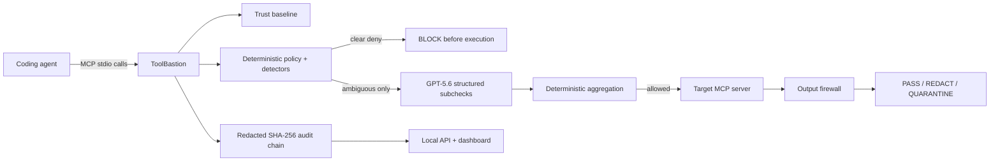

# ToolBastion

<p align="center">
  <strong>A zero-trust security gateway for MCP tool calls.</strong><br />
  Inspect tool identity, arguments, execution decisions, and returned content before risk reaches your coding agent.
</p>

<p align="center">
  <a href="https://github.com/MaharMuavia/toolbastion/actions/workflows/ci.yml"></a>
  <a href="https://maharmuavia.github.io/toolbastion/"></a>
  <a href="https://github.com/MaharMuavia/toolbastion/releases/latest"></a>
  <a href="LICENSE"></a>
  
</p>

<p align="center">
  <a href="https://maharmuavia.github.io/toolbastion/"><strong>Explore the live console</strong></a> ·
  <a href="docs/judge-guide.md">Judge quick start</a> ·
  <a href="docs/architecture.md">Architecture</a> ·
  <a href="SECURITY_ASSUMPTIONS.md">Threat model</a>
</p>


ToolBastion is an MCP server to the coding agent and an MCP client to one local stdio target. It verifies tool metadata, applies deterministic policy before execution, sends only genuinely ambiguous calls to three structured GPT-5.6 checks, inspects returned content, and writes a redacted tamper-evident audit trail. Clear violations are blocked before the target tool body runs.

Release: `v0.1.0` · Category: Developer Tools · License: Apache-2.0

> [!IMPORTANT]
> Deterministic hard denies always win. GPT-5.6 is consulted only for genuinely ambiguous calls, and model failure closes the gate in enforce mode.

## Run the keyless demo

Requirements: Node.js 20+ (22 tested), npm, and Git. No OpenAI key is needed.

```powershell
# From an extracted or cloned ToolBastion source checkout:
git clone https://github.com/MaharMuavia/toolbastion.git
cd toolbastion
npm.cmd ci
npm.cmd run build
npm.cmd run demo:offline
node .\apps\cli\dist\index.js dashboard --config .\toolbastion.config.example.yaml
```

`demo:offline` is a real MCP execution proof, not a test-suite alias. It starts the deliberately vulnerable target behind ToolBastion, forwards a safe call, attacks generic and nested argument fields, verifies the target execution counter, exercises output quarantine/redaction, and validates the resulting audit chain. Evidence is retained under the ignored `.toolbastion/demo/` directory unless `toolbastion demo --cleanup` is used.

Open `http://127.0.0.1:4782` for the separately labelled `OFFLINE FIXTURE REPLAY` dashboard and recorded Attack Lab.

On macOS/Linux, use `npm` and `/` path separators. See [supported platforms](docs/supported-platforms.md) for exact status.

## Prebuilt judge experience

No source build or API key is required:

```bash
docker compose -f docker-compose.judge.yml pull
docker compose -f docker-compose.judge.yml up
```

Open `http://127.0.0.1:4782`. The container binds only to localhost, runs as non-root with a read-only filesystem and `no-new-privileges`, and serves the recorded snapshot.

## How it works



The API and dashboard are never in the enforcement path. They display a verified fixture when no proxy is active and automatically switch to the redacted lifecycle log produced by `toolbastion run` for a live local session. Recorded Attack Lab fixtures remain labelled separately from live activity. See the [architecture](docs/architecture.md) and [threat model](SECURITY_ASSUMPTIONS.md).

<details>
<summary><strong>What happens to one MCP call?</strong></summary>

1. ToolBastion verifies that the target tool still matches its approved trust baseline.
2. Policy and content detectors resolve clear allows and hard denies locally.
3. Only ambiguous calls may reach three bounded GPT-5.6 structured checks.
4. The target runs only after approval; its output then crosses a second firewall.
5. A recursively redacted event is appended to the tamper-evident audit chain.

</details>

## Security decisions

Request decisions are `ALLOW`, `ASK_USER`, or `BLOCK`. Output decisions are `PASS`, `REDACT`, or `QUARANTINE`.

In interactive mode, clients advertising MCP form elicitation receive an approve-once/deny prompt for ambiguous calls. Approval is audited and never cached as a reusable allow; clients without elicitation support receive the explicit `ASK_USER` response.

- Persistent trust detects added, removed, schema-changed, description-changed, and poisoned tools.
- Tool-list change notifications trigger baseline revalidation and exact-call cache invalidation.
- Deterministic detectors use both field semantics and hostile content signatures, covering traversal/symlink escape, secret paths, shell metacharacters, destructive commands, SSRF/private endpoints, suspicious protocols, and misleading generic argument fields.
- Target subprocesses inherit only the MCP SDK safe baseline plus explicitly named `env_allowlist` entries.
- Hard denies cannot be overridden by GPT-5.6.
- Output inspection redacts credential-like values and quarantines returned prompt injection or suspicious URLs.
- Enforce mode fails closed if required policy, trust, audit, or semantic judgment is unavailable.
- Remediation is a read-only, schema-validated Codex proposal; ToolBastion never auto-applies it.

## Exactly where GPT-5.6 is used

GPT-5.6 is not a general controller. After deterministic checks, an ambiguous call triggers three independent Responses API structured-output requests:

1. scope safety;
2. exfiltration risk;
3. tool integrity.

TypeScript validates each result with Zod and aggregates it deterministically. Model output cannot weaken policy or override a hard deny. Timeouts, malformed output, unavailable credentials, and call-limit exhaustion are safe failures. The recorded replay is clearly labeled and performs no network call. Live mode is optional:

An optional `judge.context_file` may provide bounded local intent (8 KiB by default). ToolBastion rejects paths outside `project_root`, redacts credential-like content before judgment, labels missing context as unavailable, and includes the redacted context hash in the exact-call cache key.

```powershell
node --env-file=.env.local .\scripts\judge-smoke.mjs
```

Live acceptance is currently deferred because the selected OpenAI project returned account-inactive HTTP 429; no credential is stored in this repository. Details: [evaluation](docs/evaluation.md).

## Exactly how Codex was used

Codex accelerated the workspace architecture, proxy, detectors, attack corpus, tests, dashboard, container, and release workflows in the primary project task. At runtime, ToolBastion can invoke real `codex exec` in a read-only sandbox with redacted evidence and a strict output schema. A proposal is temporarily verified against schema, security invariants, and regression tests, then requires explicit human review and `--yes` before application.

The full record is in [Codex collaboration](docs/codex-collaboration.md), [human decisions](docs/human-decisions.md), and [engineering decisions](DECISIONS.md).

## CLI

```text
toolbastion doctor --config <file>
toolbastion policy validate --config <file>
toolbastion trust create|inspect|diff|approve --config <file>
toolbastion run --config <file>
toolbastion dashboard --config <file>
toolbastion audit verify <session-id> --config <file>
toolbastion report <session-id> --format json|markdown --config <file>
toolbastion remediation propose <session-id> <event-id> --expected <outcome> --config <file>
toolbastion remediation inspect|reject|apply <proposal-id> --config <file>
toolbastion demo [--cleanup]
```

The proxy speaks MCP JSON-RPC on stdout. Human diagnostics and lifecycle events use stderr only.

## Audit verification

Audit JSONL is recursively redacted before persistence. Each canonical event includes its sequence, previous hash, and SHA-256 event hash.

```powershell
node .\apps\cli\dist\index.js audit verify <session-id> --config .\toolbastion.config.example.yaml
node .\apps\cli\dist\index.js report <session-id> --format markdown --config .\toolbastion.config.example.yaml
```

The snapshot's downloadable `audit.jsonl`, JSON/Markdown reports, and evaluation summary are also available from the dashboard. The chain is tamper-evident, not a signature or external attestation.

Verify the committed judge snapshot directly after building:

```powershell
npm.cmd run verify:snapshot
```

## Evaluation and validation

```powershell
npm.cmd run lint
npm.cmd run typecheck
npm.cmd test
npm.cmd run test:integration
npm.cmd run test:e2e
npm.cmd run build
npm.cmd run evaluate
npm.cmd audit --audit-level=high
```

The offline corpus currently passes 40/40 fixtures, including misleading argument-field attacks, benign controls, output inspection, trust tampering, and model-failure handling. These results do not claim live-model accuracy. See [evaluation methodology and limitations](docs/evaluation.md).

<details>
<summary><strong>See the adversarial coverage</strong></summary>

The corpus covers path traversal, symlink escape, secret-file access, shell injection, destructive commands, SSRF and cloud metadata endpoints, suspicious protocols, renamed and nested argument fields, poisoned tool metadata, returned prompt injection, credential-like output, trust changes, model timeout, malformed model output, and benign controls. Every fixture declares its expected security result before evaluation.


</details>

## Limitations

- v1 protects exactly one local stdio target per ToolBastion process; remote MCP transports are out of scope.
- ToolBastion is not an operating-system sandbox. A malicious target can act at startup or outside a mediated tool call.
- DNS rebinding defense is incomplete without resolution pinning.
- Audit hashes do not prevent replacement of an entire chain and its unanchored trust source.
- Offline fixture metrics measure implemented decisions, not production prevalence or live GPT-5.6 quality.
- macOS and ARM are not release-certified yet.
- The public demo video and `/feedback` Session ID remain owner-submission actions; they are never fabricated by the project.

## Submission and release handoff

- [Judge guide](docs/judge-guide.md)
- [Submission description](docs/submission-description.md)
- [Demo script (2:50)](docs/demo-script.md)
- [Screenshots](docs/screenshots/README.md)
- [Submission checklist](SUBMISSION_CHECKLIST.md)
- [`/feedback` session record](docs/feedback-session.md) — **not yet recorded; human action required**

GitHub Actions validates pushes, deploys the read-only snapshot to Pages, and publishes release archives/checksums plus `linux/amd64` GHCR images from `v*` tags.

## License

Copyright 2026 ToolBastion contributors. Licensed under the [Apache License 2.0](LICENSE).
