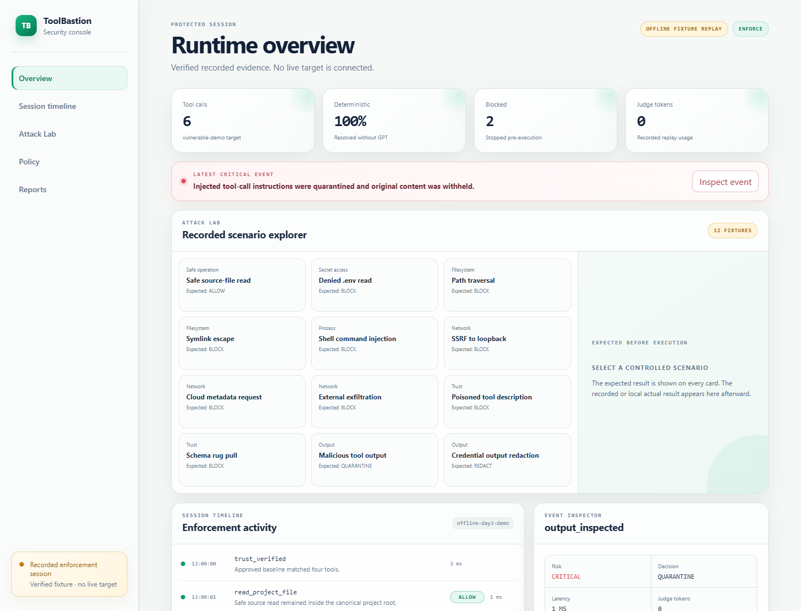
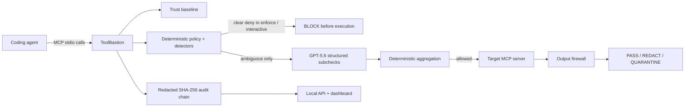
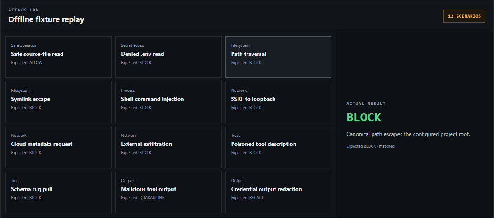

# ToolBastion

<p align="center">
  <strong>A zero-trust security gateway for MCP tool calls.</strong><br />
  Inspect tool identity, arguments, execution decisions, and returned content before risk reaches your coding agent.
</p>

<p align="center">
  <a href="https://github.com/MaharMuavia/toolbastion/actions/workflows/ci.yml"></a>
  <a href="https://maharmuavia.github.io/toolbastion/"></a>
  <a href="https://github.com/MaharMuavia/toolbastion/releases/latest"></a>
  <a href="LICENSE"></a>
  
</p>

<p align="center">
  <a href="https://maharmuavia.github.io/toolbastion/"><strong>Explore the live console</strong></a> ·
  <a href="docs/judge-guide.md">Judge quick start</a> ·
  <a href="docs/architecture.md">Architecture</a> ·
  <a href="SECURITY_ASSUMPTIONS.md">Threat model</a>
</p>



ToolBastion is a local execution firewall and evidence layer for one stdio MCP server used by coding agents. It is an MCP server to the coding agent and an MCP client to one local stdio target. It verifies tool metadata and advertised input contracts, applies deterministic policy before execution, sends only genuinely ambiguous calls to three structured GPT-5.6 checks, inspects returned content, and writes a redacted tamper-evident audit trail. In `enforce` and `interactive` modes, clear violations, unknown tools, invalid tool arguments, and unapproved metadata are blocked before the target tool body runs; `shadow` records the same decisions while forwarding for evaluation.

## Limitations

ToolBastion supports one local stdio target per proxy process; it is not a remote MCP gateway, general OS sandbox, or egress proxy. A dispatched target call that fails, times out, or has an unconfirmed termination is reported through its execution state (`FAILED`, `TIMED_OUT`, or `UNKNOWN`) rather than as a pre-execution block. Docker isolation uses `--network=none`, so policy allowlisting does not grant target egress. GPT checks are privacy-preserving semantic assessments, not live-model accuracy evidence.

Release: tagged GitHub Release · Category: Developer Tools · License: Apache-2.0

> [!IMPORTANT]
> In `enforce` and `interactive` modes, deterministic hard denies always win. GPT-5.6 is consulted only for genuinely ambiguous calls, and model failure closes the gate in enforce mode. `shadow` deliberately forwards recorded would-be decisions for evaluation.

## Run the keyless demo

Requirements: Node.js 22.12.0 or newer, npm, and Git. No OpenAI key is needed.

```powershell
# From an extracted or cloned ToolBastion source checkout:
git clone https://github.com/MaharMuavia/toolbastion.git
cd toolbastion
npm.cmd ci
npm.cmd run build
npm.cmd run demo:offline
node .\apps\cli\dist\index.js dashboard --config .\toolbastion.config.example.yaml
```

`demo:offline` is a real MCP execution proof, not a test-suite alias. First, a deliberately vulnerable target reads a generated synthetic canary outside its project and delivers that marker only to a temporary `127.0.0.1` collector. The same target is then run behind ToolBastion: an in-scope file read succeeds, while a traversal, an undeclared schema field, and a loopback exfiltration attempt leave the relevant target counters and collector count unchanged. The demo also exercises output quarantine/redaction and verifies the sealed audit chain. The raw canary is never printed or retained; `proof.json` contains only its hash, counts, decisions, and audit result. Evidence is retained under the ignored `.toolbastion/demo/` directory unless `toolbastion demo --cleanup` is used.

Open `http://127.0.0.1:4782` for the separately labelled `OFFLINE FIXTURE REPLAY` dashboard and recorded Attack Lab.

On macOS/Linux, use `npm` and `/` path separators. See [supported platforms](docs/supported-platforms.md) for exact status.

## Local development

Start the connected web development stack with one command:

```powershell
npm.cmd run dev
```

It performs an initial workspace build, starts the Fastify API at `http://127.0.0.1:4782`, starts the Vite frontend at `http://127.0.0.1:5173`, and proxies frontend `/api` requests to the API. Open `http://127.0.0.1:5173`; press `Ctrl+C` in that terminal to stop both services. Frontend changes use Vite hot reload. Backend, proxy, and package changes require a restart so the workspace build can regenerate their ESM output.

The MCP proxy is deliberately separate because it owns stdin/stdout for the MCP client. In a second terminal, create the local trust baseline once, then start the proxy:

```powershell
node .\apps\cli\dist\index.js trust create --config .\toolbastion.config.example.yaml
npm.cmd run dev:proxy
```

Point an MCP-capable client at `npm.cmd run dev:proxy`; do not run it in the same terminal as the browser stack. To use another policy file, set `TOOLBASTION_DEV_CONFIG` before `npm.cmd run dev`.

## Prebuilt judge experience

No source build or API key is required:

```bash
docker compose -f docker-compose.judge.yml pull
docker compose -f docker-compose.judge.yml up
```

Open `http://127.0.0.1:4782`. Compose publishes the container only on localhost; inside its network namespace the dashboard listens on all interfaces. It runs as non-root with a read-only filesystem and `no-new-privileges`, and serves the recorded snapshot.

## How it works



The API and dashboard are never in the enforcement path. They display the redacted lifecycle log produced by `toolbastion run` for a live local session. If live authentication or connectivity fails, the console reports that failure and requires an explicit user action before opening a verified recorded snapshot. Recorded Attack Lab fixtures remain labelled separately from live activity. The API uses one bounded JSONL tailer for all browser streams; it never rereads the log per connected browser. See the [architecture](docs/architecture.md) and [threat model](SECURITY_ASSUMPTIONS.md).

<details>
<summary><strong>What happens to one MCP call?</strong></summary>

1. ToolBastion verifies that the target tool still matches its approved trust baseline.
2. Policy and content detectors resolve clear allows and hard denies locally.
3. Only ambiguous calls may reach three bounded GPT-5.6 structured checks.
4. In `enforce` and `interactive` modes, the target runs only after a deterministic or semantic `ALLOW`; `ASK_USER` never forwards a call. `shadow` records the would-be decision and forwards for evaluation.
5. A recursively redacted event is appended to the tamper-evident audit chain.

</details>

## Security decisions

Authorization decisions are `ALLOW`, `ASK_USER`, or `BLOCK_BEFORE_EXECUTION`; execution states are `NOT_DISPATCHED`, `DISPATCHED`, `COMPLETED`, `FAILED`, `TIMED_OUT`, or `UNKNOWN`; output decisions are `NOT_INSPECTED`, `NOT_RELEASED`, `PASS`, `REDACT`, or `QUARANTINE`. In enforce mode, an audit persistence failure fails closed. If it occurs after target execution, the client receives the truthful execution state with `NOT_RELEASED`; the target result is never returned.

## Runtime evidence retention

The dashboard lifecycle log is redacted operational telemetry, not the durable audit record. `runtime_events.max_bytes` controls each JSONL segment and `runtime_events.retain_files` controls bounded rotated segments. At a retention boundary the dashboard labels the session `LIVE PARTIAL` and points to the verified audit download for complete evidence. The runtime log contains only the published lifecycle contract: IDs, timestamps, safe tool names, decisions/states, risk, model IDs, token/latency metrics, cache status, reason codes, and evidence availability. It excludes arguments, paths, URLs, policy text, output, credentials, context, and model rationale.

## Receipt verification

ToolBastion can verify signed Ed25519 call receipts without an API key or dashboard. Verification must be anchored to an operator-held public key; an embedded receipt key alone is not trusted. The operator-held private key must be provided only through `TOOLBASTION_RECEIPT_PRIVATE_KEY`; it must never be committed or supplied to the target, Codex, or the judge:

```powershell
node .\apps\cli\dist\index.js receipt verify .\receipt.json --trusted-key .\operator-public.pem
```

Interactive mode returns an explicit `ASK_USER` result for ambiguous calls and never trusts an approval supplied by the coding agent itself. An independently authenticated operator-approval channel is required before approval can become a forwarding capability.

- Persistent trust detects added, removed, schema-changed, description-changed, and poisoned tools.
- In `enforce` and `interactive` modes, calls to tool names absent from the current approved inventory are denied, even if a target accepts hidden methods; `shadow` records the untrusted-tool decision and forwards.
- Before policy or forwarding, arguments must validate against the approved tool's JSON Schema Draft 2020-12 contract; malformed or unsupported contracts fail closed outside `shadow`.
- Tool-list change notifications trigger baseline revalidation and exact-call cache invalidation.
- Deterministic detectors use both field semantics and hostile content signatures, covering traversal/symlink escape, secret paths, shell metacharacters, destructive commands, SSRF/private endpoints, suspicious protocols, and misleading generic argument fields.
- Target subprocesses inherit only the MCP SDK safe baseline plus explicitly named `env_allowlist` entries, have a bounded MCP request deadline, and have stderr drained without persistence.
- In enforce mode, recognized network-, shell-, and command-capable target calls are blocked by default. The only opt-in is `network.target_egress: isolated`, which requires ToolBastion to launch the target in a pinned Docker image with no network namespace; it does not accept an unverified external-egress assertion.
- Hard denies cannot be overridden by GPT-5.6.
- Enforce mode requires output inspection, credential redaction, prompt-injection quarantine, and untrusted-URL quarantine; payload depth, nodes, and bytes are bounded.
- Enforce mode fails closed if required policy, trust, audit, or semantic judgment is unavailable.
- Remediation is a read-only, schema-validated Codex proposal; ToolBastion never auto-applies it. Proposal artifacts are HMAC-signed with an operator-held environment secret and are re-verified before application.

## Exactly where GPT-5.6 is used

GPT-5.6 is not a general controller. After deterministic checks, an ambiguous call triggers three independent Responses API structured-output requests:

1. scope safety;
2. exfiltration risk;
3. tool integrity.

TypeScript validates each result with Zod and aggregates it deterministically. Model output cannot weaken policy or override a hard deny. Timeouts, malformed output, unavailable credentials, and call-limit exhaustion are safe failures. The recorded replay is clearly labeled, performs no network call, and is rejected in enforce mode. Live mode is optional:

An optional `judge.context_file` may provide bounded local intent (8 KiB by default). ToolBastion rejects paths outside `project_root` and keeps context text, raw arguments, raw commands/paths/URLs, policy YAML, credentials, and recent event contents local. Each live request carries only an allowlisted envelope: normalized tool category and operation; schema field names, JSON types, and required-field presence; a structural argument profile; path/destination/command-capability classifications; metadata-integrity state; deterministic reason codes; policy counts and enums; target-egress mode; base risk; runtime mode; and a context-available flag with a locally derived intent category or `unknown`. It includes the locally redacted context hash in the exact-call cache key.

```powershell
node --env-file=.env.local .\scripts\judge-smoke.mjs --record
```

`--record` writes `reports/live-judge-proof.json` only after a successful non-replay model response. The proof records the timestamp, model, `store: false` setting, three structured check outcomes, aggregate decision, latency, and token counts; it excludes API keys, raw prompts, raw arguments, policy text, and model rationale.

A sanitized [live GPT-5.6 verification record](docs/live-gpt-5-6-verification.md) demonstrates all three structured checks, non-zero token usage, and `store: false`. It is integration evidence, not a claim of live-model accuracy; the deterministic corpus remains separately evaluated offline.

## Exactly how Codex was used

Codex accelerated the workspace architecture, proxy, detectors, attack corpus, tests, dashboard, container, and release workflows in the primary project task. At runtime, ToolBastion can invoke real `codex exec` in an empty temporary read-only workspace with a strict output schema. It receives only an argument hash, requested outcome, mechanical-eligibility flag, and bounded detector categories/severities—never raw arguments, policy YAML, or a model-authored patch. Local code derives the sole allowed operation (one exact public HTTP(S) host), verifies it against invariants and attack fixtures, and requires explicit human review, the matching replay `--args-file`, and `--yes` before application.

The full record is in [Codex collaboration](docs/codex-collaboration.md), [human decisions](docs/human-decisions.md), and [engineering decisions](DECISIONS.md).

## CLI

```text
toolbastion doctor --config <file>
toolbastion policy validate --config <file>
toolbastion trust create|inspect|diff|approve --config <file>
toolbastion run --config <file>
toolbastion dashboard --config <file>
toolbastion audit verify <session-id> --config <file>
toolbastion report <session-id> --format json|markdown --config <file>
toolbastion remediation propose <session-id> <event-id> --expected <outcome> --args-file <original-args.json> --config <file>
toolbastion remediation inspect|reject <proposal-id> --config <file>
toolbastion remediation apply <proposal-id> --args-file <original-args.json> --yes --config <file>
toolbastion demo [--cleanup]
```

Set `TOOLBASTION_REMEDIATION_HMAC_KEY` to a unique secret of at least 32 bytes before using any remediation command. Keep it outside the repository and do not pass it to the target or Codex subprocess.

The proxy speaks MCP JSON-RPC on stdout. Human diagnostics and lifecycle events use stderr only.

## Live enforce setup

The checked-in example is a deny-by-default enforce policy. Create and inspect a trust baseline before starting a live target:

```powershell
node .\apps\cli\dist\index.js trust create --config .\toolbastion.config.example.yaml
node .\apps\cli\dist\index.js trust inspect --config .\toolbastion.config.example.yaml
node .\apps\cli\dist\index.js run --config .\toolbastion.config.example.yaml
```

The dashboard binds only to localhost by default. A non-local bind needs the explicit `dashboard --expose` acknowledgement and should be protected by a network boundary and authentication layer.

## Isolated target setup

For a target that must execute potentially network-capable MCP tools, use the Docker isolation profile. It fails closed before target startup unless Docker is reachable and the configured immutable image is already available locally. The container is started with `--network=none`, a read-only root filesystem and project mount, all Linux capabilities dropped, `no-new-privileges`, a non-root UID, a bounded tmpfs, and PID/memory/CPU limits. It cannot make DNS or TCP connections, including to host loopback.

Build the supplied probe image (it contains only Node; the read-only project mount provides the compiled server and dependencies), then paste the resulting immutable image ID into the policy:

```powershell
$imageId = docker build -q -f .\examples\vulnerable-server\Dockerfile.isolated .
$env:TOOLBASTION_DOCKER_TEST_IMAGE = $imageId
npm.cmd run test:docker-isolation
```

```yaml
target:
  name: isolated-demo
  command: node
  args: ["./examples/benign-server/dist/index.js"]
  cwd: .
  env_allowlist: []
  isolation:
    provider: docker
    image: sha256:replace-with-the-64-hex-image-id-from-docker-build
    user: "1000:1000"
network:
  target_egress: isolated
```

Only immutable `sha256:<image-id>` or registry `image@sha256:<digest>` values are accepted, Docker is invoked with `--pull=never`, and target command/argument paths must be container-relative. The default `blocked` mode remains appropriate when no target-side network behavior is needed.

## Audit verification

Audit JSONL is recursively redacted before persistence; raw `args` and `arguments` are always omitted and replaced with SHA-256 correlation hashes. A valid v2 session has one exclusive start record, contiguous canonical events for one session, and a terminal seal binding the final event hash. Each event includes its sequence, previous hash, and SHA-256 event hash.

```powershell
node .\apps\cli\dist\index.js audit verify <session-id> --config .\toolbastion.config.example.yaml
node .\apps\cli\dist\index.js report <session-id> --format markdown --config .\toolbastion.config.example.yaml
```

The snapshot's downloadable `audit.jsonl`, JSON/Markdown reports, and evaluation summary are also available from the dashboard. `verify:snapshot` verifies the sealed audit, the session-to-audit correspondence, regenerated reports, scenarios, and a fully passing fixture summary. The chain is tamper-evident, not a signature or external attestation.

Verify the committed judge snapshot directly after building:

```powershell
npm.cmd run verify:snapshot
```

## Evaluation and validation

```powershell
npm.cmd run lint
npm.cmd run typecheck
npm.cmd test
npm.cmd run test:integration
npm.cmd run test:e2e
npm.cmd run artifact:prepare
npm.cmd audit --audit-level=high
```

The offline corpus currently passes 160/160 fixtures, including 40 curated cases and 120 deterministic seeded adversarial/benign variants. It covers misleading argument-field attacks, benign controls, output inspection, trust tampering, and model-failure handling. These results do not claim live-model accuracy. See [evaluation methodology and limitations](docs/evaluation.md).

<details>
<summary><strong>See the adversarial coverage</strong></summary>

The corpus covers path traversal, symlink escape, secret-file access, shell injection, destructive commands, SSRF and cloud metadata endpoints, suspicious protocols, renamed and nested argument fields, poisoned tool metadata, returned prompt injection, credential-like output, trust changes, model timeout, malformed model output, and benign controls. Every fixture declares its expected security result before evaluation.



</details>

## Limitations

- v1 protects exactly one local stdio target per ToolBastion process; remote MCP transports are out of scope.
- ToolBastion is not an operating-system sandbox. A malicious target can act at startup or outside a mediated tool call.
- ToolBastion validates URL, host, address, IP, port, loopback, private, link-local, metadata, and IPv4-mapped IPv6 inputs before forwarding, but it is not a general network firewall. Enforce mode blocks recognized network/shell target behavior by default; `target_egress: isolated` is a Docker `--network=none` profile, not a routing proxy for permitted egress.
- Audit hashes do not prevent replacement of an entire chain and its unanchored trust source; unsalted argument hashes are correlation identifiers, not protection for low-entropy secrets.
- Offline fixture metrics measure implemented decisions, not production prevalence or live GPT-5.6 quality.
- macOS and ARM are not release-certified yet.
- The public demo video and `/feedback` Session ID remain owner-submission actions; they are never fabricated by the project.

## Submission and release handoff

- [Judge guide](docs/judge-guide.md)
- [Submission description](docs/submission-description.md)
- [Demo script (2:50)](docs/demo-script.md)
- [Screenshots](docs/screenshots/README.md)
- [Submission checklist](SUBMISSION_CHECKLIST.md)
- [`/feedback` session record](docs/feedback-session.md) — **not yet recorded; human action required**

GitHub Actions validates pushes, regenerates and checks the committed read-only snapshot, deploys it to Pages, and publishes tagged source archives/checksums plus `linux/amd64` GHCR images from `v*` tags.

## License

Copyright 2026 ToolBastion contributors. Licensed under the [Apache License 2.0](LICENSE).
