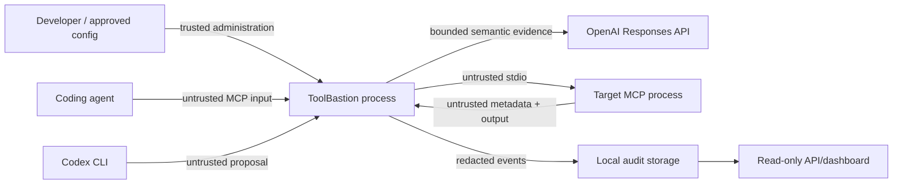

# Threat model and security assumptions

## Scope and assets

ToolBastion protects agent-initiated MCP tool discovery, tool calls, and returned results for one local stdio target. Assets include project files, local credentials, network authority, command execution, approved tool metadata, policy, audit integrity, and the agent's future decisions.

ToolBastion is not an operating-system sandbox, endpoint protection product, identity provider, or remote MCP gateway.

## Trust boundaries

The ToolBastion installation, operating account, configured project root, and deliberate human approvals are trusted. MCP metadata, arguments, results, YAML input, model output, Codex output, subprocess output, and network-derived text are untrusted.

## Threats and controls

| Threat | Example | Primary controls | Residual risk |
| --- | --- | --- | --- |
| Path escape | `../`, UNC/drive path, symlink outside root | canonical/real path checks, explicit deny patterns, pre-execution block | filesystem races and platform edge cases need continued review |
| Secret access/exposure | `.env`, SSH/AWS files, returned key | sensitive-path denies, environment allowlist, recursive persistence redaction, output redaction | novel secret formats may evade pattern detection |
| Shell injection | chaining, substitution, encoded PowerShell | metacharacter/destructive/download-pipe detectors, `shell: false` subprocesses | allowed commands still execute with the target account's OS rights |
| SSRF/exfiltration | loopback, cloud metadata, private IP, unapproved domain | URL normalization, protocol/port/domain rules, private/link-local/metadata denies | DNS rebinding protection is incomplete without resolution pinning |
| Tool rug pull | changed schema/description or poisoned metadata | persistent canonical tool baseline, hash validation, explicit approve workflow | an already-approved malicious implementation can lie behind unchanged metadata |
| Prompt injection in output | returned instruction to call another tool | output injection scan and quarantine before agent forwarding | semantic attacks outside current patterns may pass |
| Policy tampering | edited baseline hash or weakened remediation | baseline self-hash, Zod validation, hard-deny invariants, regression verification | an attacker controlling both repository and trusted anchor can replace them |
| Model manipulation/failure | malicious prompt text, malformed result, timeout | delimited redacted evidence, isolated structured subchecks, Zod validation, deterministic aggregation, fail-closed enforce mode | model judgment remains probabilistic for ambiguous inputs |
| Context-file escape/leak | context points outside project or contains a credential | canonical project-root confinement, 64 KiB hard cap, secret redaction, cache binding | novel secret formats may evade redaction; supplied context remains untrusted semantic input |
| Remediation escalation | Codex proposes broader access | read-only `codex exec`, stripped key, schema output, temporary verification, no auto-apply, explicit `--yes` | a human may still approve a harmful but valid-looking patch |
| Audit repudiation | line edit or deletion | canonical sequence and previous/event SHA-256 hashes, verification before reports | chain is not signed or externally anchored; whole-chain replacement is possible |
| Denial of service | target hang, model timeout, malformed log | bounded timeouts/call caps, controlled errors, child cleanup, safe close | local resource exhaustion remains possible |

## Security invariants

- Deterministic hard denies cannot be overridden by GPT-5.6, Codex, cache, dashboard, or user-facing labels.
- Enforce mode fails closed when required policy, trust, audit, or judgment is unavailable.
- A blocked tool call is not forwarded to the target.
- Target results are inspected before forwarding to the agent.
- Raw secrets are never intentionally logged or persisted.
- Remediation never auto-applies.
- The dashboard and API are outside the enforcement path.
- Recorded semantic data is labeled and never claimed as a live result.

## Out of scope and known limitations

- Target behavior during process startup, shutdown, or outside a tool call.
- Compromise of the ToolBastion host, installation, OS account, or project administrator.
- Multiple targets, remote HTTP/SSE MCP transports, remote OAuth, and enterprise identity.
- Complete resources/prompts passthrough and full conversation context unless explicitly supplied.
- Strong audit non-repudiation; the current chain is tamper-evident, not a signature or external attestation.
- Complete DNS rebinding protection, kernel isolation, filesystem virtualization, or network namespace enforcement.
- Certification on macOS or ARM for this release.

## Reporting

Do not include a real secret in a vulnerability report or reproduction fixture. Use the security contact/process configured by the eventual public repository. Until that exists, keep reports private to the repository owner and provide only synthetic evidence.
