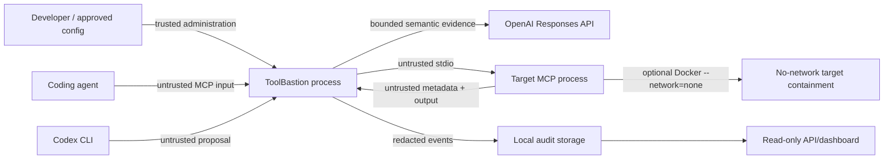

# Threat model and security assumptions

## Scope and assets

ToolBastion is a security gateway and evidence layer for mediated MCP calls, with optional target-process containment. It mediates agent-initiated MCP tool discovery, tool calls, and returned results for one local stdio target. Assets include project files, local credentials, network authority, command execution, approved tool metadata, policy, audit integrity, and the agent's future decisions.

ToolBastion is not a general operating-system sandbox, endpoint protection product, identity provider, or remote MCP gateway. Its optional Docker profile confines one target to a no-network, read-only, capability-dropped container; it does not create a general egress proxy or protect a compromised host.

## Trust boundaries

The ToolBastion installation, operating account, configured project root, and external operator approval channel (when added) are trusted. MCP metadata, arguments, results, YAML input, model output, Codex output, subprocess output, and network-derived text are untrusted. An MCP client response is not treated as proof of human approval.

## Threats and controls

| Threat | Example | Primary controls | Residual risk |
| --- | --- | --- | --- |
| Path escape | `../`, UNC/drive path, symlink outside root | canonical/real path checks, explicit deny patterns, pre-execution block | filesystem races and platform edge cases need continued review |
| Secret access/exposure | `.env`, package-manager credentials, cloud profiles, private keys, Terraform state, returned key | deterministic credential-path denies, environment allowlist, recursive persistence redaction, output redaction | novel secret formats may evade pattern detection |
| Shell injection | chaining, substitution, encoded PowerShell | metacharacter/destructive/download-pipe detectors, `shell: false` subprocesses | allowed commands still execute with the target account's OS rights |
| SSRF/exfiltration | loopback, cloud metadata, private IP, unapproved domain | schema-validated per-tool capability contracts, URL/host/address/IP normalization, protocol/port/domain rules, private/link-local/metadata and IPv4-mapped IPv6 denies; enforce mode requires Docker containment for declared network-denied, command, subprocess, or destructive capabilities and rejects `network: allowlist` until a real proxy exists | all-egress-denied containment does not provide permitted egress through an authenticated proxy; host compromise remains out of scope |
| Tool rug pull | changed schema/description, poisoned metadata, or undeclared call argument | persistent canonical tool baseline, hash validation, strict advertised-input validation, explicit approve workflow | an already-approved malicious implementation can lie behind unchanged metadata |
| Prompt injection in output | returned instruction to call another tool | output injection scan and quarantine before agent forwarding | semantic attacks outside current patterns may pass |
| Policy tampering | edited baseline hash or weakened remediation | baseline self-hash, Zod validation, hard-deny invariants, regression verification | an attacker controlling both repository and trusted anchor can replace them |
| Model manipulation/failure | malicious prompt text, malformed result, timeout | delimited redacted evidence, isolated structured subchecks, Zod validation, deterministic aggregation, fail-closed enforce mode | model judgment remains probabilistic for ambiguous inputs |
| Context-file escape/leak | context points outside project or contains a credential | canonical project-root confinement, 64 KiB hard cap, local redaction/cache binding; external judgment receives only context availability, argument shape, and policy counts/enums | untrusted tool metadata still reaches the external judge; supplied context remains untrusted semantic input |
| Remediation escalation | Codex proposes broader access | empty temporary read-only workspace, minimal environment, fixed-shape metadata only, schema output, locally derived exact-host operation, regression verification, matching replay input, no auto-apply, explicit `--yes` | a human may still declare a harmful public host legitimate; mechanical verification is not business authorization |
| Audit repudiation | line edit, deletion, partial write, or mixed session | exclusive v2 start/event/seal lifecycle, strict canonical records, contiguous session/sequence validation, fsync writes, single-read verification before reports | chain is not signed or externally anchored; whole-chain replacement is possible |
| Denial of service | target hang, oversized arguments/results, model timeout, malformed log | bounded target/judge timeouts, inflight-call cap, bounded payload traversal, child cleanup, safe close | MCP transport parsing and local resource exhaustion remain possible |

## Security invariants

- Deterministic hard denies cannot be overridden by GPT-5.6, Codex, cache, dashboard, or user-facing labels. `shadow` is the explicit exception to forwarding behavior: it records the hard-deny decision but forwards for evaluation.
- Enforce mode fails closed when required policy, trust, audit, or judgment is unavailable.
- Enforce mode requires a reviewed capability contract for every target tool. Detectors provide supporting evidence only and cannot grant a capability. Declared network-denied, command, subprocess, or destructive capability requires an immutable Docker target with `--network=none`; `network: allowlist` fails closed until a real authenticated egress proxy exists.
- A blocked tool call is not forwarded to the target in `enforce` and `interactive` modes.
- Target results are inspected before forwarding to the agent.
- Raw secrets are never intentionally logged or persisted.
- Remediation never auto-applies.
- The dashboard and API are outside the enforcement path.
- Recorded semantic data is labeled and never claimed as a live result.

## Out of scope and known limitations

- Target behavior during process startup, shutdown, or outside a tool call when Docker isolation is not selected.
- Compromise of the ToolBastion host, installation, OS account, or project administrator.
- Multiple targets, remote HTTP/SSE MCP transports, remote OAuth, and enterprise identity.
- Complete resources/prompts passthrough and full conversation context unless explicitly supplied.
- Strong audit non-repudiation; the current chain is tamper-evident, not a signature or external attestation.
- Permitted target-side egress, authenticated outbound proxies, remote MCP transports, Docker daemon compromise, or complete host/kernel compromise. The Docker profile intentionally gives the target no network namespace; it is not an allowlisted egress solution.
- Certification on macOS or ARM for this release.

## Reporting

Do not include a real secret in a vulnerability report or reproduction fixture. Use the security contact/process configured by the eventual public repository. Until that exists, keep reports private to the repository owner and provide only synthetic evidence.
