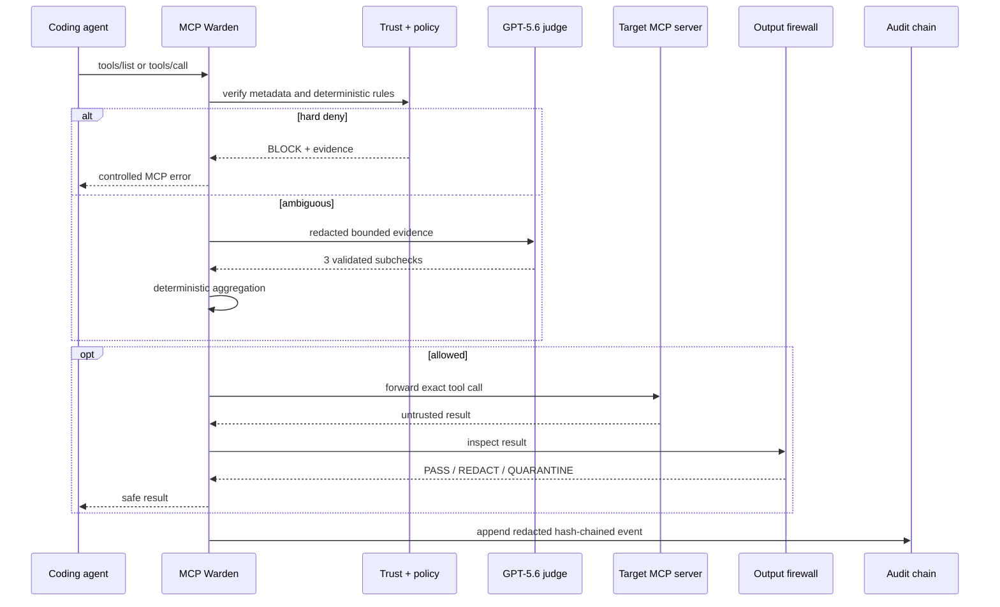
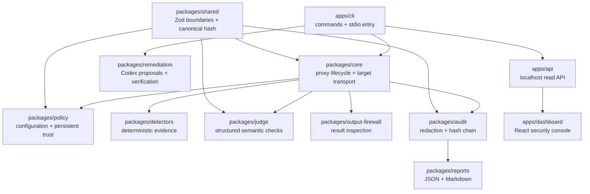

# Architecture

MCP Warden is a bidirectional security boundary for one local stdio MCP target. It presents an MCP server to the coding agent and owns an MCP client connection to the target. The dashboard is observational and cannot affect proxy reliability.

## Runtime path

## Package boundaries

All cross-package and external data is validated with Zod. Target and remediation subprocesses use argument arrays with `shell: false`. MCP protocol output is isolated on stdout; diagnostics use stderr.

## Decision order

1. Validate configuration and persistent trust integrity.
2. Compare current tool metadata to the approved baseline.
3. Normalize and scan arguments using deterministic detectors.
4. Immediately block hard-deny findings.
5. Reuse only an exact-call cache entry when valid.
6. Escalate genuinely ambiguous evidence to three independent GPT-5.6 checks.
7. Aggregate validated subchecks in TypeScript.
8. Forward only allowed calls.
9. Inspect target output before returning it.
10. Persist only redacted, hash-chained evidence.

## Modes

- `enforce`: violations block; required-stage failure closes safely.
- `interactive`: ambiguous cases return `ASK_USER`; deterministic hard denies still block.
- `shadow`: produces decisions/evidence for evaluation without claiming enforcement.
- offline replay: uses recorded structured decisions and is always labeled as recorded.

## Reliability boundary

The proxy and target transport do not depend on Fastify, React, or a browser. Closing the dashboard cannot stop enforcement. The read-only hosted snapshot contains static redacted artifacts and no API credentials.
