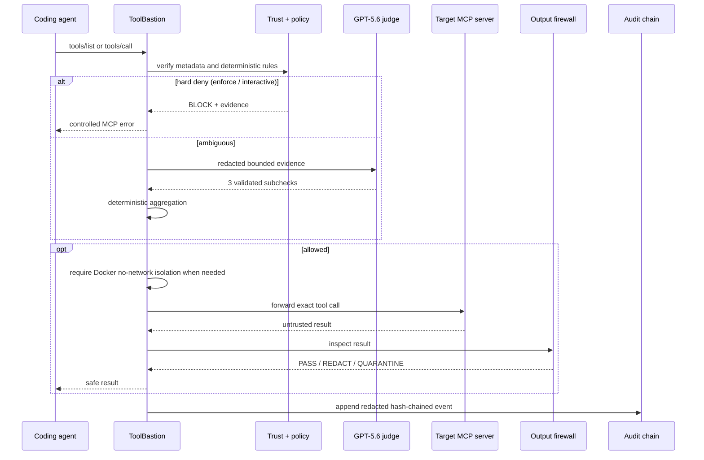
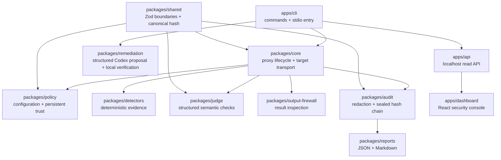

# Architecture

ToolBastion is a bidirectional security boundary for one local stdio MCP target. It presents an MCP server to the coding agent and owns an MCP client connection to the target. The dashboard is observational and cannot affect proxy reliability.

## Runtime path

## Package boundaries

Zod validates configuration, persisted artifacts, API inputs, and model/remediation outputs. Untrusted target results are handled defensively as `unknown` data by the output firewall. Target and remediation subprocesses use argument arrays with `shell: false`. Targets inherit the SDK's safe environment baseline plus explicitly allowlisted variables; arbitrary parent-process variables are not copied. MCP protocol output is isolated on stdout; diagnostics use stderr.

## Decision order

1. Validate configuration and persistent trust integrity.
2. Compare current tool metadata to the approved baseline and repeat that comparison whenever the target emits `notifications/tools/list_changed`.
3. Validate arguments against the trusted tool's advertised JSON Schema contract. Invalid or unsupported contracts fail closed outside shadow mode.
4. Normalize and scan arguments using field semantics plus content-based signatures, so generic keys such as `input`, `value`, and `payload` do not bypass clear path, URL, bare-host, or shell attacks.
5. In enforce mode, block recognized network-, shell-, and command-capable target calls while `network.target_egress` is `blocked`; `isolated` requires the Docker no-network profile at target startup.
6. Immediately block hard-deny findings in `enforce` and `interactive`; `shadow` records the same finding and continues for evaluation.
7. Load optional bounded operator context from inside the project root, redact it locally, and include its hash in the exact-call cache identity.
8. Reuse only an exact-call cache entry when the tool schema, policy, arguments, mode, and context hash all match.
9. Escalate genuinely ambiguous evidence to three independent GPT-5.6 checks; fixture replay is unavailable in enforce mode.
10. Aggregate validated subchecks in TypeScript.
11. Forward only allowed calls.
12. Inspect target output before returning it.
13. Persist only redacted, start/event/seal hash-chained evidence.

## Modes

- `enforce`: violations block; required-stage failure closes safely.
- `interactive`: ambiguous cases return `ASK_USER` and are not forwarded. The MCP client is untrusted, so its own response cannot authorize execution.
- `shadow`: produces decisions/evidence for evaluation without claiming enforcement.
- offline replay: uses recorded structured decisions, is always labeled as recorded, and cannot run in enforce mode.

## Target egress boundary

ToolBastion sees MCP messages, not TCP connections made by an arbitrary target. `network.target_egress` therefore defaults to `blocked` in enforce mode for recognized network, shell, and command execution. `isolated` is the only alternative: ToolBastion verifies that an immutable Docker image is available and launches the target with `--network=none`, a read-only project mount beneath an image-owned runtime dependency directory, dropped capabilities, `no-new-privileges`, non-root UID, bounded tmpfs, and PID/memory/CPU limits. The container cannot resolve or connect to any network destination; this is containment, not an allowlisted egress proxy.

## Reliability boundary

The proxy and target transport do not depend on Fastify, React, or a browser. Closing the dashboard cannot stop enforcement. `toolbastion run` writes a separately redacted lifecycle JSONL file for local observation; the API reads it without participating in decisions. Audit evidence uses exclusive v2 start/event/seal files; CLI and live-dashboard readers canonicalize the configured audit directory and session file beneath `project_root`, then consume one verified read rather than verify-then-reread. If no valid live log exists, the dashboard falls back to the verified fixture. The hosted snapshot contains static redacted artifacts and no API credentials.
