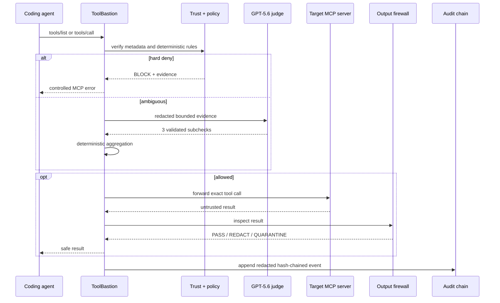
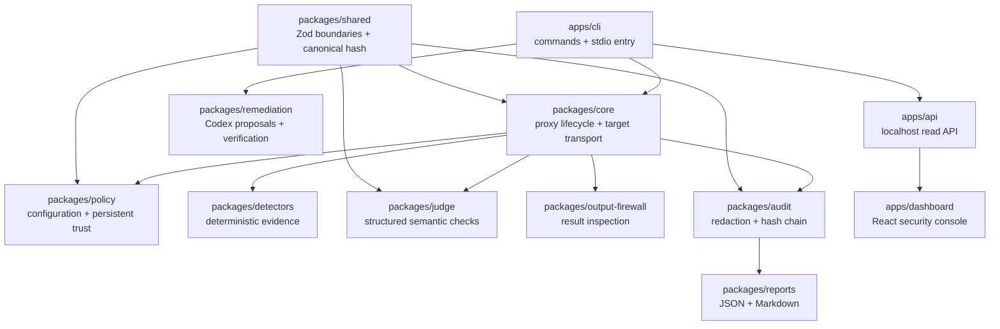

# Architecture

ToolBastion is a bidirectional security boundary for one local stdio MCP target. It presents an MCP server to the coding agent and owns an MCP client connection to the target. The dashboard is observational and cannot affect proxy reliability.

## Runtime path

## Package boundaries

All cross-package and external data is validated with Zod. Target and remediation subprocesses use argument arrays with `shell: false`. Targets inherit the SDK's safe environment baseline plus explicitly allowlisted variables; arbitrary parent-process variables are not copied. MCP protocol output is isolated on stdout; diagnostics use stderr.

## Decision order

1. Validate configuration and persistent trust integrity.
2. Compare current tool metadata to the approved baseline and repeat that comparison whenever the target emits `notifications/tools/list_changed`.
3. Normalize and scan arguments using field semantics plus content-based signatures, so generic keys such as `input`, `value`, and `payload` do not bypass clear path, URL, or shell attacks.
4. Immediately block hard-deny findings.
5. Load optional bounded operator context from inside the project root, redact it, and include its hash in the exact-call cache identity.
6. Reuse only an exact-call cache entry when the tool schema, policy, arguments, mode, and context hash all match.
7. Escalate genuinely ambiguous evidence to three independent GPT-5.6 checks.
8. Aggregate validated subchecks in TypeScript.
9. Forward only allowed calls.
10. Inspect target output before returning it.
11. Persist only redacted, hash-chained evidence.

## Modes

- `enforce`: violations block; required-stage failure closes safely.
- `interactive`: ambiguous cases use MCP form elicitation when the client supports it. An accepted decision approves only that exact invocation; decline blocks, unsupported elicitation returns `ASK_USER`, and deterministic hard denies still cannot be approved.
- `shadow`: produces decisions/evidence for evaluation without claiming enforcement.
- offline replay: uses recorded structured decisions and is always labeled as recorded.

## Reliability boundary

The proxy and target transport do not depend on Fastify, React, or a browser. Closing the dashboard cannot stop enforcement. `toolbastion run` writes a separately redacted lifecycle JSONL file for local observation; the API reads it without participating in decisions. If no valid live log exists, the dashboard falls back to the verified fixture. The hosted snapshot contains static redacted artifacts and no API credentials.
